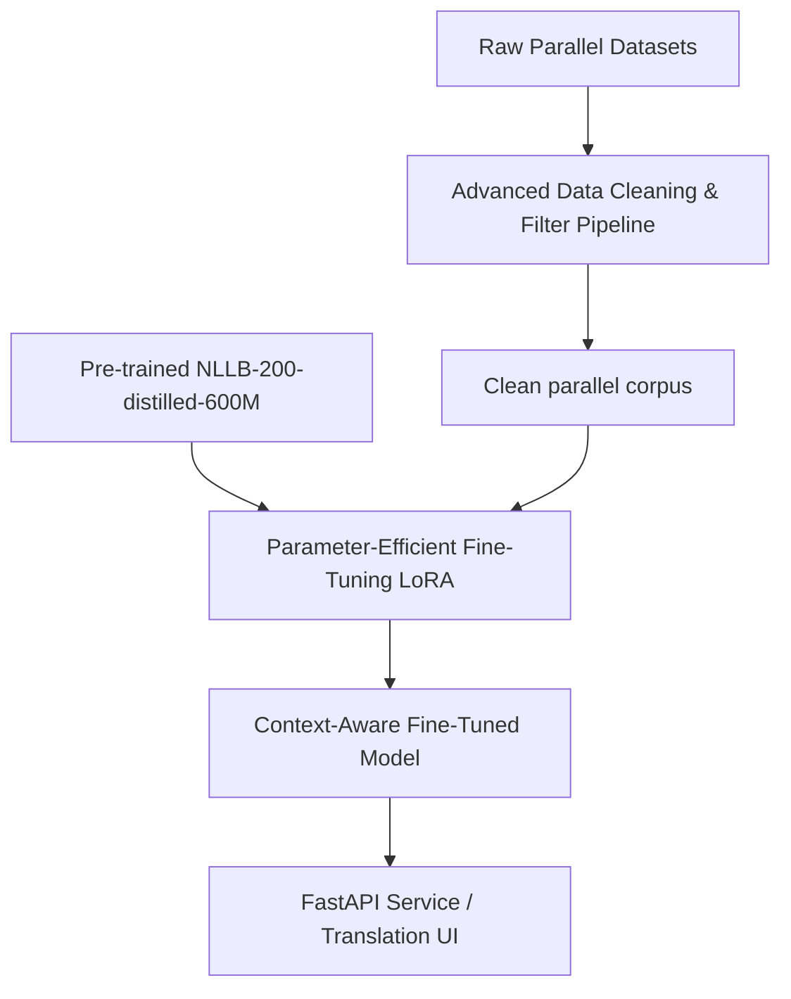

# Taura 2.0 — Machine Translation Master Plan & Recipe

This document serves as the authoritative blueprint for building a bidirectional (Kikuyu ↔ English) machine translation system capable of handling complex morpho-syntactic structures and semantic context variations.

---

## 1. Scientific & Linguistic Context

Kikuyu (Gĩkũyũ) is a morphologically rich, agglutinative Bantu language. Translation challenges include:
*   **Agglutination:** Single words consist of a root verb combined with subject prefixes, tense markers, object infixes, and aspect suffixes (e.g., *nĩndamũrũrire* $\rightarrow$ "I looked at him"). Standard word-by-word mapping fails.
*   **Noun Classes:** 18 grammatical noun classes govern strict concord (agreement) across verbs, adjectives, and pronouns.
*   **Semantic Variation:** Homographs change meaning based on context (e.g., tone and surrounding tokens).

To resolve these, we must use a context-aware sequence-to-sequence model rather than static bilingual word projection.

---

## 2. High-Accuracy Translation Recipe

Our goal is to achieve **70–75%+ translation accuracy** (equivalent to a BLEU score of $25.0+$ and ChrF score of $50.0+$ on low-resource test splits) using transfer learning on pre-trained multilingual models.

### Recipe Blueprint

| Ingredient | Description | Purpose |
| :--- | :--- | :--- |
| **Base Model** | `facebook/nllb-200-distilled-600M` | Distilled, fast, handles `kik_Latn` and `eng_Latn` natively. |
| **Vocabulary** | NLLB SentencePiece Tokenizer (256K vocabulary) | Captures subwords, morphemes, and prevents Out-of-Vocabulary (OOV) errors. |
| **Fine-Tuning Method** | LoRA (Low-Rank Adaptation) on attention projection layers ($W_q, W_v$) | Prevents catastrophic forgetting; allows training on 8GB VRAM. |
| **Data Regularization** | Label Smoothing ($0.1$) & Dropout ($0.2$) | Combats overfitting on small low-resource sets. |

---

## 3. Step-by-Step Implementation Procedures

### Step 1: Establish the Evaluation Pipeline (Run first!)
Before training any model, we must establish a standalone evaluation suite to run on a golden test split of 500 hand-verified parallel sentences:
1.  **ChrF/ChrF++ (Character F-score):** Primary metric. Essential for Bantu languages to evaluate prefix/suffix alignment.
2.  **BLEU (n-gram precision):** Standard corpus-level fluency metric.
3.  **COMET/BLEURT (Neural Similarity):** Uses cross-lingual embeddings to capture semantic similarity even if translation uses synonyms.

### Step 2: Advanced Dataset Filtering
1.  **Language Identification:** Filter Hugging Face datasets using a pre-trained FastText LangID model to remove non-Kikuyu languages (e.g. Indonesian, Tamil).
2.  **Script/Character Filtering:** Remove rows containing non-Latin alphabets or missing Kikuyu-specific character markers (`ĩ` and `ũ`).
3.  **Similarity Thresholding:** Drop parallel pairs with similarity scores below $1.15$ in mined corpora.

### Step 3: Kaggle Remote GPU Fine-Tuning
1.  **Draft training script** utilizing Hugging Face `Seq2SeqTrainer` with support for mixed precision (`fp16`).
2.  **Export training configurations** and datasets to Kaggle using the Kaggle API.
3.  **Execute LoRA fine-tuning** using Kaggle's free Tesla T4 GPU (30+ hours/week).
4.  **Save & Download** the LoRA weights (`adapter_model.bin`) back to the `models/` folder.

### Step 4: Bidirectional Service Integration
1.  Extend the FastAPI service (`app/serve/main.py`) to support the fine-tuned NLLB model.
2.  Maintain the existing retrieval mode as a fallback/hybrid system for exact phrase matching.

---

## 4. Timeline & Milestones

*   **Milestone 1: Evaluation Pipeline Setup** — Create evaluation test harness (`scripts/evaluate_seq2seq.py`) and golden test dataset.
*   **Milestone 2: Data Cleaning & Normalization** — Write script to filter noisy Hugging Face corpora.
*   **Milestone 3: LoRA Training Deployment** — Train NLLB-200 model on Kaggle remote GPU.
*   **Milestone 4: API & Web UI Integration** — Port the model weights to the live FastAPI server.
