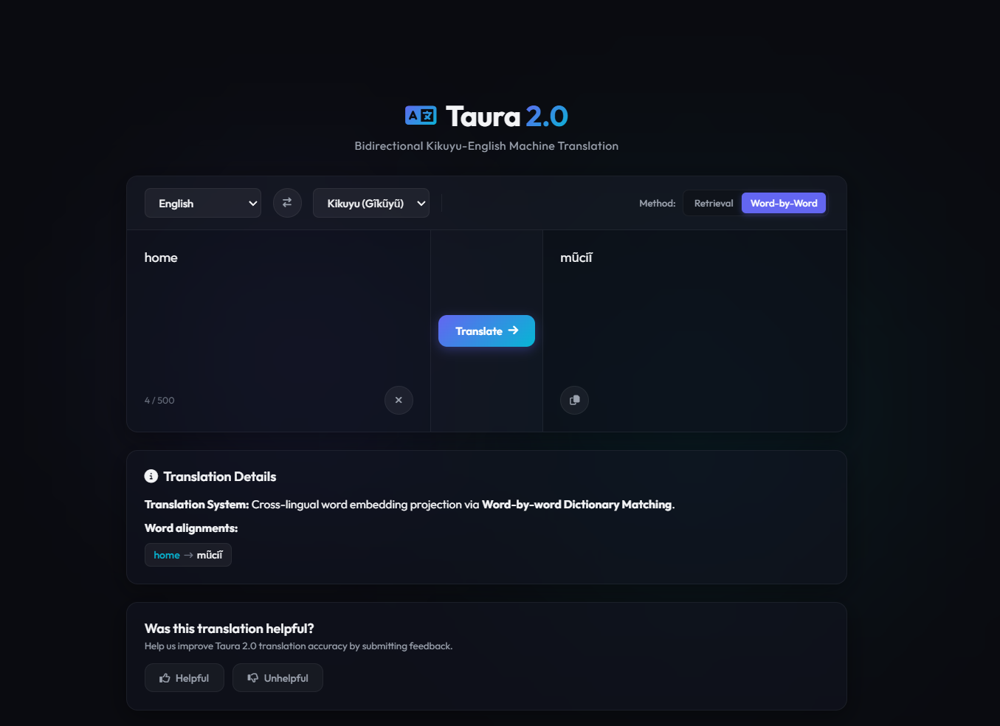

# Taura 2.0

Machine translation model and API service for translating between Kikuyu and English.

The name "taura" is derived from the Kikuyu word "Taũra", which means "Translate".



---

## Features

- **FastText Word Embeddings:** Monolingual embeddings trained specifically on curated Kikuyu and English sentence datasets.
- **Orthogonal Procrustes Alignment:** Learns a linear translation matrix mapping between Kikuyu and English embedding spaces using parallel anchor points.
- **Dual Translation Modes:**
  - `retrieval`: Finds the closest aligned candidate sentence from a target text corpus using cosine similarity (best for semantic phrase matching).
  - `word-by-word`: Projects each source word to the target space and retrieves the closest target vocabulary item (best for lexical translation).
- **Top-K Candidates:** Returns N-best translation hypotheses ranked by cosine similarity for downstream re-ranking.
- **Model Info Endpoint:** Exposes model version, hyperparameters, and live evaluation metrics via API.
- **FastAPI Web Service:** Endpoints for real-time bidirectional translation with validation.
- **Robust Verification:** Complete suite of unit and integration tests using BDD-style assertions.

---

## Getting Started

### 1. Prerequisites

- Python 3.12+
- uv (for dependency and virtual environment management)

### 2. Installation & Setup

Clone the repository and install the project dependencies:

```bash
git clone https://github.com/Garnet-Owl/taura-2.0.git
cd taura-2.0
uv sync
```

> **Note on Data and Models:** The large training corpora and `.bin` FastText model files are excluded from this repository to respect size limits. They will be uploaded to a Google Drive account, and you can download them from there and place them in the `data/` and `models/` directories respectively before running the pipeline.

---

## Running the Pipeline

### Step 1: Preprocess the Dataset
Downloads the parallel Kikuyu-English corpus from Hugging Face, cleans the text, and splits it into `train`, `val`, and `test` datasets:

```bash
uv run python -m scripts.prepare_dataset
```

### Step 2: Train Embeddings and Alignment Matrices
Trains monolingual FastText models and solves the orthogonal Procrustes problem to generate projection matrices:

```bash
uv run python -m scripts.train_embeddings
```
Training metrics (e.g., top-1/top-5 accuracy and MRR) will be printed and saved to `models/evaluation_metrics.json`.

### Step 3: Run Offline Evaluation (Optional)
Evaluates trained models on the test split and saves BLEU/ChrF scores:

```bash
uv run python -m scripts.evaluate
```

### Step 4: Start the Translation Service
Run the development server to launch both the API and the Web UI:

```bash
uv run uvicorn app.serve.main:app --reload
```

Once the server is running, you can access:
- **Web UI:** Open your browser and navigate to [http://localhost:8000](http://localhost:8000) to use the interactive translation frontend.
- **API Documentation:** Navigate to [http://localhost:8000/docs](http://localhost:8000/docs) to explore the interactive Swagger API documentation.

---

## Current Model Performance

| Direction | Metric | Score |
| :--- | :--- | :---: |
| Kikuyu → English | Top-1 Accuracy | 41.3% |
| Kikuyu → English | Top-5 Accuracy | 65.2% |
| Kikuyu → English | MRR | 0.529 |
| English → Kikuyu | Top-1 Accuracy | 43.9% |
| English → Kikuyu | Top-5 Accuracy | 63.6% |
| English → Kikuyu | MRR | 0.535 |

*Trained on ~2.2M parallel sentence pairs from the CGIAR Kikuyu-English dataset.*

---

## API Usage Examples

### Health Check
Check the API server health status:
```bash
curl http://localhost:8000/health
```
Response:
```json
{
  "status": "healthy",
  "service": "Taura Kikuyu-English Translation Service"
}
```

### Translate Sentence (Retrieval Method)
Translate a Kikuyu phrase into English using retrieval mode:
```bash
curl -X POST http://localhost:8000/translate \
  -H "Content-Type: application/json" \
  -d '{"text": "Mũndũ ũmwe nĩ arakorirũo na thĩna", "source_lang": "ki", "target_lang": "en", "method": "retrieval"}'
```

### Translate Sentence (Word-by-Word Method)
Translate an English sentence into Kikuyu using word-by-word lexical translation:
```bash
curl -X POST http://localhost:8000/translate \
  -H "Content-Type: application/json" \
  -d '{"text": "the man is reading a book", "source_lang": "en", "target_lang": "ki", "method": "word-by-word"}'
```

### Get Top-K Translation Candidates
Retrieve the 5 most similar translation candidates with cosine similarity scores:
```bash
curl -X POST http://localhost:8000/translate/candidates \
  -H "Content-Type: application/json" \
  -d '{"text": "the man is reading", "source_lang": "en", "target_lang": "ki", "k": 5}'
```

### Get Model Information
Retrieve model version, hyperparameters, and evaluation metrics:
```bash
curl http://localhost:8000/model/info
```

---

## Running Tests

Execute the automated test suite containing 29 unit and integration tests:

```bash
uv run pytest
```

---

## License

This project is licensed under the MIT License - see the [LICENSE](LICENSE) file for details.
